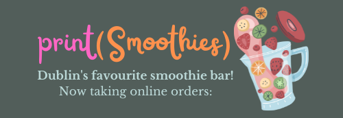
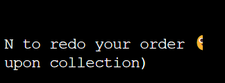
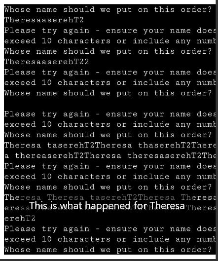
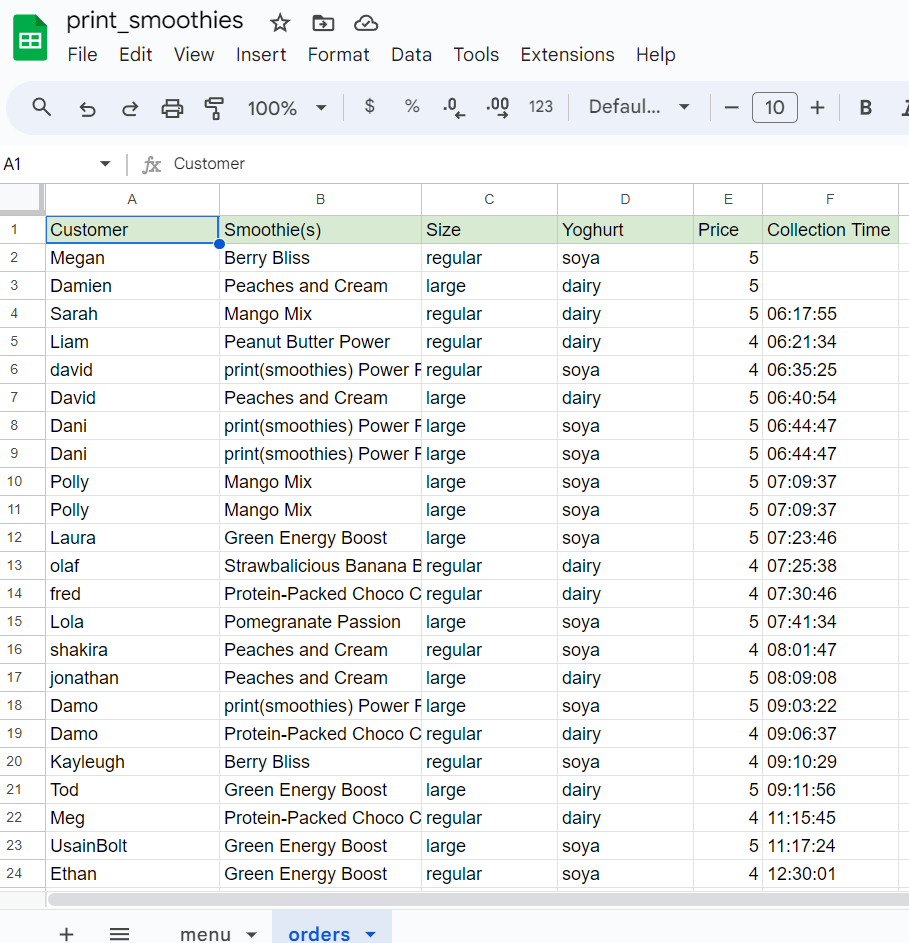
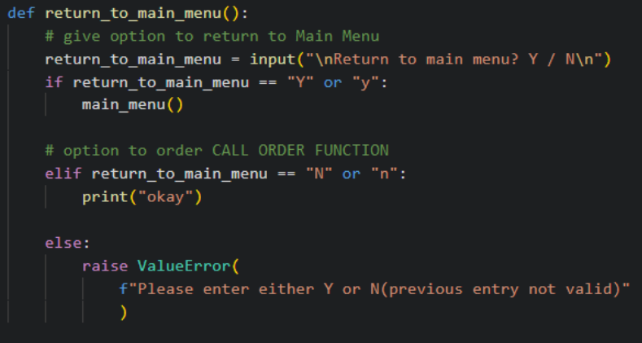
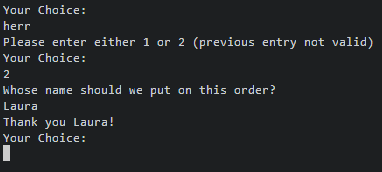
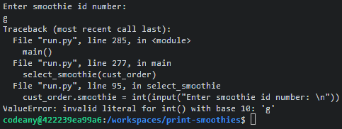
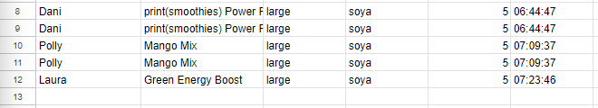
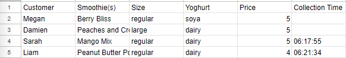
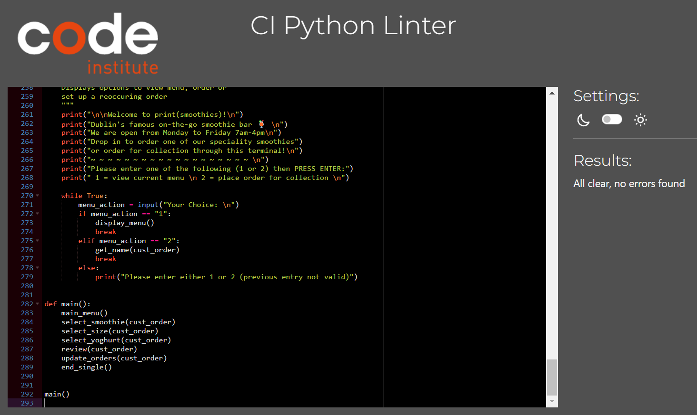

# **Print Smoothies**

## **Site Overview**

Print(smoothies) is a fictional smoothie bar in Dublin's city centre.
This program has been developed to allow customer's to preorder their items or set up a reoccuring order to collect every week.
The program is linked via API to a Google Sheet which management can use to see data on the orders.

## **Table Of Contents**

1. [**Site Overview**](#site-overview)
2. [**Project Goals**](#project-goals)
   - [Site Owner Goals](#site-owner-goals)
   - [How This Will Be Achieved](#how-this-will-be-achieved)
3. [**UX**](#ux)
   - [Strategy and Scope](#strategy-and-scope)
     - [User Stories](#user-stories)
     - [User Requirements](#user-requirements)
   - [Structure and Skeleton](#structure-and-skeleton)
     - [Flow Chart](#flow-chart)
   - [Surface](#surface)
4. [**Testing and Validation**](#testing-and-validation)
   - [Bugs](#bugs)
     - [Solved Bugs](#solved-bugs)
     - [Validatior Testing](#validator-testing)
     - [Unfixed Bugs](#unfixed-bugs)
5. [**Deployment and Development**](#deployment-and-development)
6. [**Credits**](#credits)
   - [Technologies Used](#technologies-used)
   - [Media](#media)
   - [Content](#content)
   - [Code](#code)
   - [Acknowledgements](#acknowledgements)

---

## **Project Goals**

### **Site Owner Goals**

Print(smoothies) is a popular smoothie bar that gets a lot of regular customers in the Dublin city area. Their customers have requested an ordering program so that they can book their smoothies ahead of time and collect them within the hour. 
The site owner would like to provide this facility to their customers. They would also like to be able to edit their menu and display it via the program.

### **How This Will Be Achieved**

- The site owner would like to be able to change the menu on the program and also see the orders which is why the program will be linked to a Google Sheet via API.

- A flowchart will identify the steps needed to make the program and necessary functions to include.

- The program will be designed with the user in mind. Customers sometimes make errors in the ordering process, they will want the program to be intuitive and for it to give feedback often. The program should be intuitive to navigate.

---

## **UX**

### **Strategy and Scope**

#### **User Stories**

As a user I would like:
- to be able to preorder my smoothie through the terminal
- to personalise my order (drink's size, type of base, name of order etc)
- to get feedback throughout the ordering process
- to be given a time for collection
- to have a enjoyable experience with the program

#### **User Requirements**

| Requirements                         | Importance | Viability |
| ------------------------------------ | :-
-------: | --------: |
| Give name for order                  |     5      |         5 |
| See menu items                       |     5      |         5 |
| Choose size of drink and base milk   |     5      |         5 |
| Feedback at every step of process    |     5      |         5 |
| Collection time                      |     5      |         5 |
| Option to add more than one drink    |     4      |         4 |
| Option to edit orders of 2+ drinks   |     4      |         4 |
| Option to set up a reoccuring order  |     5      |         4 |

All requirements with an importance and viability of 5 have been included in the curret program.
As print(smoothies) does have a lot of regular customers, the option to set up a reoccuring order will be the next feature to implement before the requirement to add more than one drink to an order.

### **Structure and Skeleton**

#### **Flow Chart**

This flowchart made with Lucidchart helped me to identify the necessary steps for my program.

### **Surface**

## **Testing and Validation**

- I tested the game in the following browsers: Chrome, Firefox, Safari and Edge.
- The only issue encountered on Firefox related to the Unicode characters missing half of their display:

No other issues with the program were detected in the browser testing.

- The game has been tested on multiple mobile devices in person and via all the available devices on Dev Tools toolbar.
This program does not work well on iPhone (particularly as there is no 'enter' button only a 'return' which two of my friends who tested the program said would not let them input anything). This issue appears to only apply to iPhone and not Apple iOs in general as the program runs well on Mac (excep as seen below where the name 'Theresa', when entered on a Mac computer, caused a once-off bug.)

- The API linking the data to the Google Sheet was tested extensively and information is updating as expected:

### **Bugs**

#### **Solved Bugs**

- My original get_name() function accepted numbers for the customer name. Researching and implemeting the 'isaplpha' string method resolved this.

- The return_to_main_menu() function, orignially accepted any character for Y or N. 

Implementing a 'while' loop solved this.

- I forgot to include a break in my get_name() loop which caused the following bug:

- When a letter was entered instead of a number for the smoothie choice, the following error appeared:

This was resolved by using a try and except statement which now prompts the user again and declares a ValueError.

- When orders were edited, a duplicate order was saved to the Google Sheet.

This was resolved by calling the proceeding functions for the order again directly in the while loop review()

- The program was charging 5euro for all smoothies regardless of size when I defined the price condition outside of the _size function. For this iteration I have defined the prices within the size function but for future iterations this code may need to be revised as prices will need to be added together for multiple orders.

#### **Validator testing**

- The program was validated via the Code Institute Linter and returned no errors.

#### **Unfixed bugs**

- There are no unfixed bugs.

---

## **Deployment and Development**

The live link can be found here - [print smoothies link](https://print-smoothies-86336ab6a539.herokuapp.com/)

---

## **Credits**

### **Technologies Used**

- [Balsamiq](https://balsamiq.com/) to create the wireframes.
- [Codeanywhere](https://codeanywhere.com/) IDE for editing the site.
- [Github](https://github.com/) to host the repository and deploy the site.
- [Google Dev Tools](https://developer.chrome.com/docs/devtools/) to troubleshoot and test ideas
- [Am I Responsive?](https://ui.dev/amiresponsive) to generate an image showing responsivness of the site across multiple devices.

### **Media**

- [Vecteezy.com](https://www.vecteezy.com/free-vector/rock-paper-scissors) the The image for the rock, paper and scissors.
- [Google Fonts](https://fonts.google.com/) to source and import all fonts.
- [Font Awesome](https://fontawesome.com/) for the icons in the rules section and GitHub icon in footer.
- [Favicon](https://favicon.io/) where the site's favicon was sourced.

### **Code**

- Two JavaScript functions were adopted from the 'Rock, Paper, Scissors' walkthrough by Matt Rudge via Code Institute.

- I found this article helpful regarding font-sizing and rem [Why I change the font size to 62.5%](https://javascript.plainenglish.io/why-i-change-the-font-size-to-62-5-in-every-project-45c5ff785fb5)

### **Acknowledgements**

- Thank you to Code Institute - the content creators, my mentor, the tutors and the Slack community who all contributed to my understanding of JavaScript fundamentals during this project.

[Return to top](#table-of-contents)